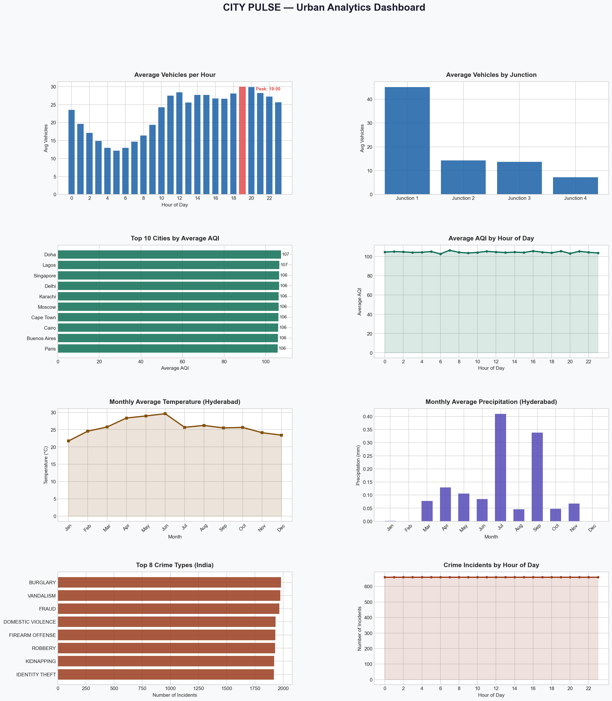
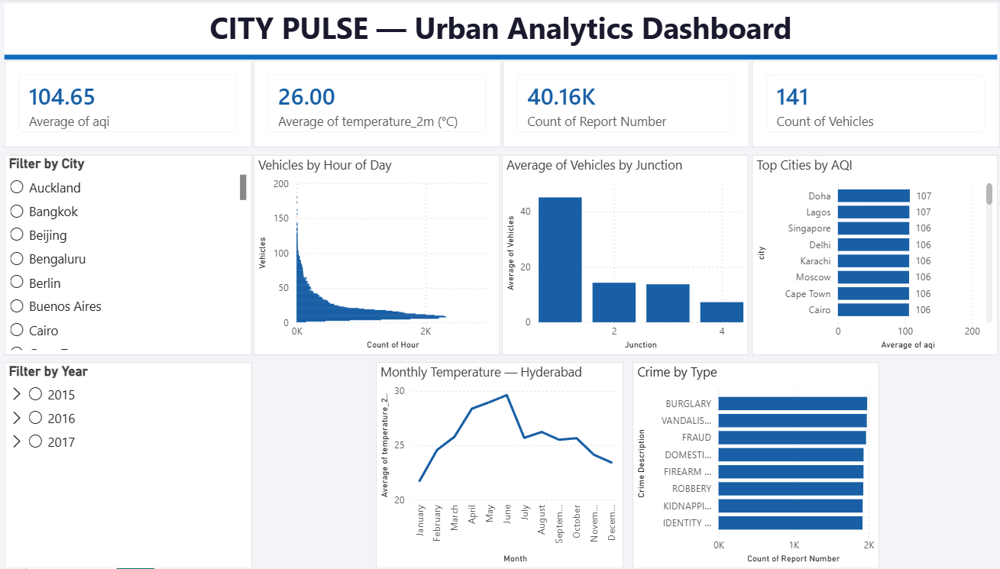

# 🏙️ City Pulse — Urban Analytics Platform

A multi-domain urban analytics project analyzing **traffic, air quality, weather, and crime** data using Python, PostgreSQL, Power BI and Streamlit.

## 🚀 Live Demo
https://city-pulse-hqzhbikx3pqeymnfddfngs.streamlit.app/

---

## 📊 Project Overview

City Pulse is an end-to-end data analytics platform that ingests data from 4 urban domains, models them in SQL, runs Python analysis, and delivers both an interactive Streamlit web app and a Power BI dashboard — covering over **114,000+ records** across multiple cities.

---

## 🗂️ Domains Covered

| Domain | Dataset | Records |
|--------|---------|---------|
| 🚗 Traffic | Vehicle counts by junction & hour | 48,122 |
| 🌫️ Air Quality | AQI, PM2.5, NO2 across global cities | 18,002 |
| 🌤️ Weather | Temperature, precipitation, humidity (Hyderabad) | 8,041 |
| 🚨 Crime | Incident reports across Indian cities | 40,161 |
| | **Total** | **114,326** |

---

## 🏗️ Architecture / Workflow

```
Raw CSV Files
      │
      ▼
PostgreSQL Database (city_pulse)
      │
      ├──► Python Analysis (pandas, matplotlib, seaborn)
      │         │
      │         ▼
      │    city_pulse_dashboard.png (8 charts)
      │
      ├──► Power BI Dashboard
      │         │
      │         ▼
      │    City_Pulse_PowerBI.pbix (interactive)
      │
      └──► Streamlit Web App
                │
                ▼
         Live deployment on Streamlit Cloud
```

**Step-by-step flow:**
1. **Ingest** — 4 CSV datasets loaded into PostgreSQL database
2. **Store** — Data modeled into 4 tables (traffic, air_quality, weather, crime)
3. **Analyze** — Python pulls data from PostgreSQL, runs EDA and generates charts
4. **Visualize** — Power BI connects to PostgreSQL for interactive dashboard
5. **Deploy** — Streamlit app reads CSVs and serves live web dashboard

---

## 🛠️ Tools & Technologies

- **Python** — pandas, matplotlib, seaborn, sqlalchemy, plotly
- **PostgreSQL** — database design, table creation, data import
- **Power BI** — interactive dashboard with cards and slicers
- **Streamlit** — deployed interactive web application
- **VS Code** — development environment

---

## 📁 Project Structure

```
city_pulse/
├── streamlit_app.py            # Streamlit web app (deployed)
├── city_pulse_analysis.py      # Python analysis & visualization
├── requirements.txt            # Dependencies for deployment
├── city_pulse_dashboard.png    # Python-generated dashboard (8 charts)
├── powerbi_dashboard.png       # Power BI dashboard screenshot
├── City_Pulse_PowerBI.pbix     # Power BI interactive dashboard
├── traffic.csv                 # Traffic dataset
├── good_air_quality.csv        # Air quality dataset
├── weather.csv                 # Weather dataset
└── crime_dataset_india.csv     # Crime dataset
```

---

## 🔍 Key Insights

- **Peak traffic hour** is 19:00 (7 PM) across all junctions
- **Doha and Lagos** have the highest average AQI (107)
- **Hyderabad temperature** peaks in May–June reaching 29°C+
- **Burglary and Vandalism** are the most common crime types in India

---

## 📸 Dashboard Screenshots

### 🐍 Python Dashboard (matplotlib)


### 📊 Power BI Dashboard


---

## 📈 Dashboard Features

### Streamlit Web App (Live)
- 4 metric cards (Total Traffic, Avg AQI, Avg Temperature, Total Crime)
- Interactive sidebar filters (city, junction, year, crime city)
- 8 dynamic Plotly charts across all 4 domains
- Color-coded sections per domain

### Python Dashboard
- 8 static charts covering all domains
- Peak traffic hour highlighted in red
- Monthly weather trends for Hyderabad

### Power BI Dashboard
- 4 cards showing key metrics
- Interactive city and year slicers
- 5 dynamic charts across all domains

---

## ▶️ How to Run Locally

1. Clone the repository:
```
git clone https://github.com/Sravya-Kallempudi/city-pulse.git
cd city-pulse
```

2. Install dependencies:
```
pip install -r requirements.txt
```

3. Run the Streamlit app:
```
streamlit run streamlit_app.py
```

4. For the full Python analysis (requires PostgreSQL):
```
pip install pandas psycopg2-binary matplotlib seaborn sqlalchemy
python city_pulse_analysis.py
```

---

## 👩‍💻 Author

**Sravya**

---


